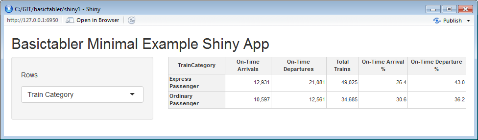

## In This Vignette

* About Shiny
* Examples
* Minimal Example

## About Shiny

Shiny is an R package that makes it easy to build interactive web applications (apps) straight from R.

Good starting points for using Shiny are:

* [Overview](https://shiny.posit.co/)
* [Video Tutorial](https://shiny.posit.co/tutorial/)
* [Detailed Written Articles](https://shiny.posit.co/articles/)

## Examples

This vignette presents a basic example to get started using `basictabler` with Shiny.  It is not intended to be a fully featured application, rather to help the reader get started quickly using `basictabler` with Shiny.

To use the example, create a new single-file Shiny web application in RStudio, then paste the R code into the app.R file.

## Minimal Example

```{r, message=FALSE, warning=FALSE, eval=FALSE}
library(shiny)
library(htmlwidgets)
library(dplyr)
library(basictabler)

ui <- fluidPage(

   titlePanel("Basictabler Minimal Example Shiny App"),

   sidebarLayout(
      sidebarPanel(

         selectInput("groupBy", label = h5("Rows"),
                     choices = list("Train Category" = "TrainCategory",
                                    "TOC" = "TOC",
                                    "Power Type" = "PowerType"), selected = "TOC")
      ),

      mainPanel(
         basictablerOutput('tbl')
      )
   )
)

server <- function(input, output) {
  
   output$tbl <- renderBasictabler({
     
     tocsummary <- bhmsummary %>%
       group_by_(input$groupBy) %>%
       summarise(OnTimeArrivals=sum(OnTimeArrivals),
                OnTimeDepartures=sum(OnTimeDepartures),
                TotalTrains=sum(TrainCount)) %>%
       ungroup() %>%
       mutate(OnTimeArrivalPercent=OnTimeArrivals/TotalTrains*100,
             OnTimeDeparturePercent=OnTimeDepartures/TotalTrains*100) %>%
       arrange_(input$groupBy)
     
     # formatting values (explained in the introduction vignette)
     columnFormats=list(NULL, list(big.mark=","), list(big.mark=","), list(big.mark=","), "%.1f", "%.1f")
    
     # create the table and render
     tbl <- BasicTable$new()
     tbl$addData(tocsummary, firstColumnAsRowHeaders=TRUE,
                explicitColumnHeaders=c(input$groupBy, "On-Time Arrivals", "On-Time Departures",
                                        "Total Trains", "On-Time Arrival %", "On-Time Departure %"),
                columnFormats=columnFormats)

     basictabler(tbl)
   })
}

shinyApp(ui = ui, server = server)
```



## Further Reading

The full set of vignettes is:

1. [Introduction](v01-introduction.html)
2. [Working with Cells](v02-workingwithcells.html)
3. [Outputs](v03-outputs.html)
4. [Styling](v04-styling.html)
5. [Finding and Formatting](v05-findingandformatting.html)
6. [Shiny](v06-shiny.html)
7. [Excel Export](v07-excelexport.html)
